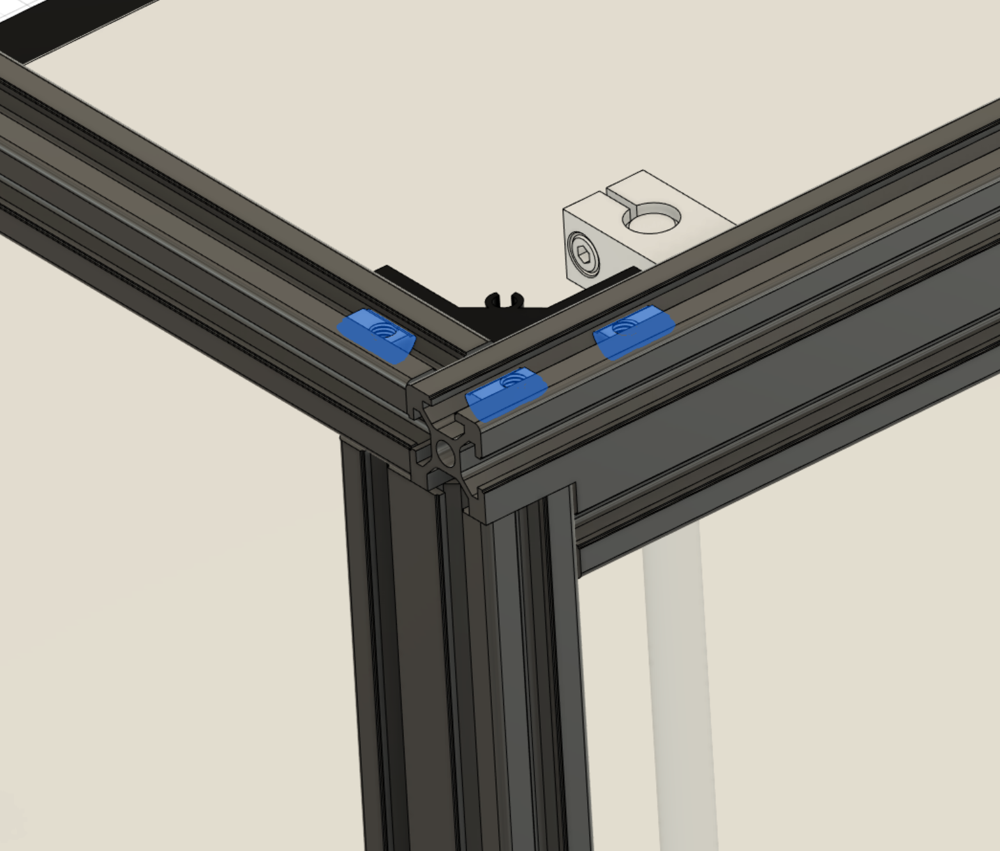

# Standalone Knob Tensioners

This mod is designed to provide a simple and sturdy solution for tensioning belts on the Ender 5 Plus(Need confirmation for the Ender 5) Mercury 1 and Mercury 1.1 Systems

## Description

This Mod is derived from the enclosure project I am currently working on (Jan-2023). In order to provide a version that can be used by the entire Mercury community. I have forked the design and will upload the enclosure version once I am done. This was inspired by the Voron V0. This provides a sturdy solution for tensioning your belt while maintaining a design that allows clearance for an enclosure.  

## Dependencies

* **Please print in ABS or ASA**
* Due to the tight clearances of a part like this, I recommend this part be printed on a properly calibrated printer
* I **Do not** recommend scaling the parts via a slicer as you may have issues with fitment

## Bill of Materials
Item Name | Quantity | Notes
| :--- | :---: | :---
M5x12mm BHCS | 2 | Needed for Rear Mount
M5x25mm BHCS | 2 | Needed for Inside Mount
M3x6MM BHCS | 8 | Needed to secure lid
M3x4mmx5mm Heatset Inserts | 8 | Needed to secure lid
M5 T-Nut | 6 | You should have at least 4 existing T-nuts from the Original BOM
M5x20mm SHCS | 2 | From Original BOM
M5x30mm PIN | 2 | From Original BOM
M5x1mm Shim | 4 | From Original BOM
F695 Bearing | 4 | From Original BOM

## Installation

### Step 1 - Install Heatset Inserts

* Install the Heatset inserts with a soldering iron for both the Left and Right Frame printed parts
* Total amount of Heatsets to install is **8**

### Step 2 - Mount Frame to Extrusions

* Install the T-Nuts on both sides of the extrusion frame
* Total amount of T-Nuts to install is **6**

* Install the M5x12mm BHCS at the Rear Mount hole
* Install the M5x25mm BHCS at the Inside Mount hole (This is a longer bolt to provide more structural rigidity)
* Repeat these steps on the other side as well
* Total amounts 
   * M5x12mm BHCS quantity of **2**
   * M5x25mm BHCS quantity of **2**

### Step 3 - Install Bearing Stack

* Install the bearing stack as prescribed in the original instructions for the Mercury Printers
* At this time you should insert the M5x20mm SHCS since the bolt will be held captive once the tensioner is inserted to the frame
* Repeat this process on both sides
* Total amounts 
   * M5x20mm SHCS quantity of **2**
   * M5x30mm PIN quantity of **2**
   * M5x1mm Shim quantity of **4**
   * F695 Bearing quantity of **4**

### Step 4 - Install Belt

* If this is a new build, follow the steps prescribed in the original instructions for the Mercury Printers
* if this is a retrofit, you will need to install as pictured below

### Step 5 - Install Tensioner

* Slide in the tensioner to the frame
* Attach the M5x20mm SHCS to the T-Nut but **Do Not** fully tighten
* **Note** - the M5x20mm SHCS may catch on the initial hole
   * The Stadium Shaped Slot can be used to lift the bolt
   * This slot also exists in case you need to uninstall the tensioner - *since it will be captive once fully inserted*
   * A pick and hook can be used for this or a small screwdriver

### Step 6 - Install Knob

* Install the knob but **Do Not** fully tighten until everything is installed 

### Step 7 - Install Lids

* Install the lids on the sides of the frame
* Use the M3x6MM BHCS screws to secure the lids
* Total amount of M3x6MM BHCS screws to install is **8**

## How to use

* Tension using the Knob
    * Ensure you are tensioning equally on both sides i.e 1/8th turn on each side simultaneously

* Lock using the internal bolt inside the Stadium Shaped Slot

## Help

* Please reach out to me directly on discord if you have any issues or suggestions for this Mod 

## Authors

Vprince099 aka Vengeful Discord - Vengeful#8648

## Version History
    
* 0.1
    * Initial Release

## License

This project is licensed under the GNU GENERAL PUBLIC LICENSE - see the LICENSE.md file for details

## Acknowledgments

* ZeroG - Original Towers used to expand upon [Link to Project](https://github.com/ZeroGDesign/Mercury.git)
* Voron Design - V0 Team for Knob and Thread Appendage [Link to Project](https://github.com/VoronDesign/Voron-0.git)

