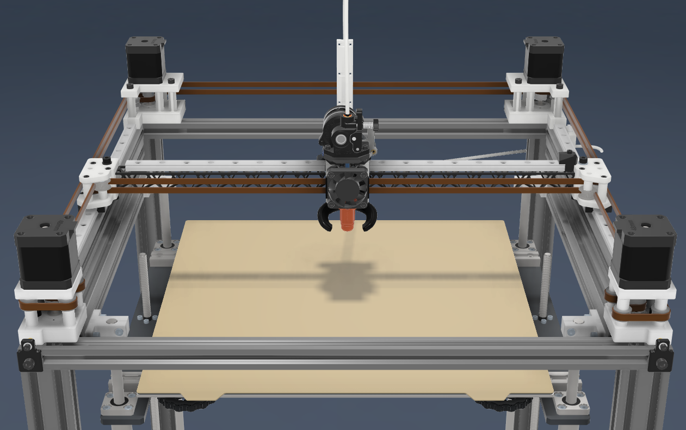

# Full AWD 6mm Mercury1.1 mod -- !! In testing !!


# The mods are in testing, the parts may or may not fit right. I am not responsible for any damage this may cause.

# BOM:
Some parts will not be mentioned because they come with the mercury kit.
| Type | Quantity | Link |
| --- | --- | --- |
| Shoulder skrews 40mm long 5mm! shaft with M3 thread ([check picture](IMAGES/Shoulder_skrews.png) ) | 16 | [Aliexpress](https://www.aliexpress.com/item/1005004802215831.html) |
| M5 1mm shims (6 you can extract from the tensioners) | 18 | [Nindejin](https://www.aliexpress.com/item/4000174460068.html) |
| F695-2RS bearings(4 are in the tensioners) | 12 | [Fushi](https://www.aliexpress.com/item/32850989216.html) |
| M5x30 dowel pins (the ones from the tensioners) | 2 |  |
| M5x55 screws | 4 | [Nindejin](https://aliexpress.com/item/1005005267980793.html) |
| M5x20 screws(2 from the tensioners) | 4 | [Nindejin](https://vi.aliexpress.com/item/4000142028043.html) |
| M5x10 screws | 2 | [Nindejin](https://aliexpress.com/item/4000142028043.html) |
| M5 T-nut | 2 | [Aliexpress](https://aliexpress.com/item/32706208829.html) |
| M5 Heatset insert M5 X D7.0 X L9.0 | 2 | [Aliexpress](https://vi.aliexpress.com/item/4000232990523.html)  |
| M3 heat set inserts (from the tensioners) | 2 |  |
| 8.5mm GT2 20 tooth pulley | 2 | [Mellow](https://www.aliexpress.com/item/1005004374407134.html) |
| GT2 or GT3 6mm belts | 6 Meters | [TriangleLab](https://www.aliexpress.com/item/1005006507781085.html) |
| GT2 20 tooth motor pulley for 6mm belt 5mm shaft | 2 | [Mellow](https://www.aliexpress.com/item/33002989677.html) |
| Motors like the one you use in the back to match | 2 | [Biqu](https://biqu.equipment/products/ldo-42sth48-2504ac-reva-motor-driver?variant=39991585636450) |
| Stepper drivers available to drive the extra motors | 2 |  |

## Optional for Double shear:
| Type | Quantity | Link |
| --- | --- | --- |
| Motors with 35mm minimum shaft lenght | 4 | [RatRig](https://ratrig.com/electronics/motors/nema-17-stepper-motor-ht-48mm-1-8-76oz-in-35mm-shaft.html)|
| 695-2RS bearings | 4 | [Fushi](https://vi.aliexpress.com/item/1005003141257945.html) |

# Belt paths
**:warning:! You must flip the xjoints bearing stacks and pulleys upside down !:warning:**

## Bottom belt path


## Top belt path


# How to sync motors

[VZbot Motor sync](https://www.youtube.com/watch?v=so9oqJyirKY)

# Printer config

-The X and Y motors are now swithed and rotating backwards because of the new belt path so the pins must be swithed 

-The front motors will be defined as stepper_x1 and stepper_y1 the step and dir pins will need to have the same sign in front ( both x and x1 sould have DIR and STEP pin with ! or without, same for y and y1)

-Lower the homing speed to 10 and the motor amps to 0.4 or as low as you cand get them to move so that you have time to stop the printer if it goes the wrong direction and minimize the damage if the endstop pins are wrong.

My config as an example:
```
[stepper_x]
step_pin: PC14
dir_pin: !PC13
enable_pin: !PE6
microsteps: 16
rotation_distance: 40
endstop_pin: ^EBBCan:PB6
position_endstop: 386
position_max: 386
homing_speed: 150

[tmc5160 stepper_x]
cs_pin: PD6
spi_software_sclk_pin: PC6
spi_software_mosi_pin: PC8
spi_software_miso_pin: PC7
#diag1_pin: PC15
run_current: 1.400
sense_resistor: 0.022
#stealthchop_threshold: 999999


[stepper_x1]
step_pin: PE2
dir_pin: !PE1
enable_pin: !PE0
microsteps: 16
rotation_distance: 40

[tmc5160 stepper_x1] 
cs_pin: PD4
spi_software_sclk_pin: PC6
spi_software_mosi_pin: PC8
spi_software_miso_pin: PC7
#diag1_pin: PF1
run_current: 1.400
sense_resistor: 0.022
#stealthchop_threshold: 999999


[stepper_y]
step_pin: PE5
dir_pin: !PE4
enable_pin: !PE3
microsteps: 16
rotation_distance: 40
endstop_pin: PC0
position_endstop: 370
position_max: 370
position_min: 0
homing_speed: 150

[tmc5160 stepper_y]
cs_pin: PD5
spi_software_sclk_pin: PC6
spi_software_mosi_pin: PC8
spi_software_miso_pin: PC7
#diag1_pin: PF0
run_current: 1.400
sense_resistor: 0.022
#stealthchop_threshold: 999999


[stepper_y1]
step_pin: PB9
dir_pin: !PB8
enable_pin: !PB7
microsteps: 16
rotation_distance: 40

[tmc5160 stepper_y1] 
cs_pin: PD3
spi_software_sclk_pin: PC6
spi_software_mosi_pin: PC8
spi_software_miso_pin: PC7
#diag1_pin: PF2
run_current: 1.400
sense_resistor: 0.022
#stealthchop_threshold: 999999
```
