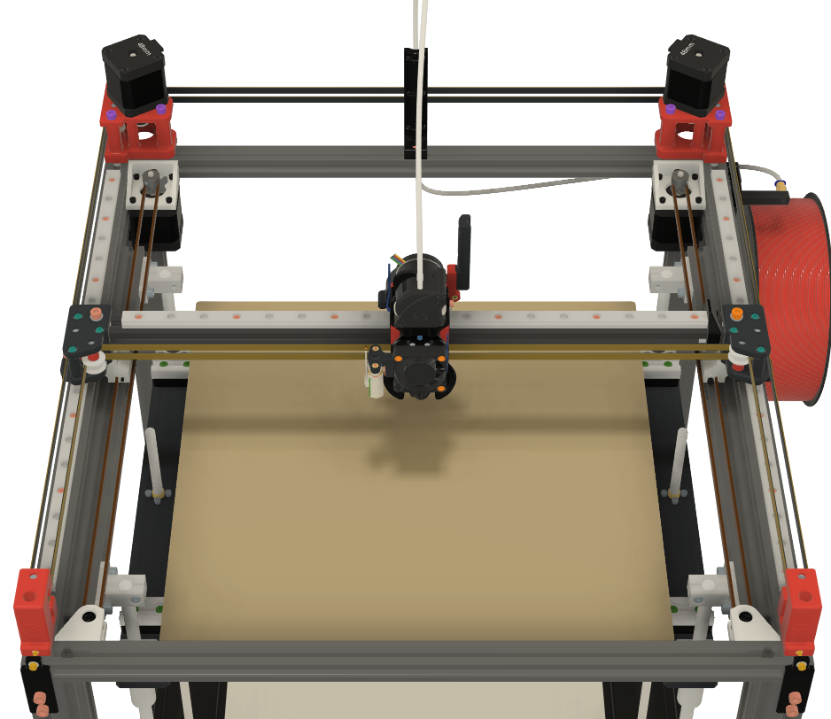

# Hybrid CoreXY Mod



# BOM:
| Type | Quantity | Link |
| --- | --- | --- |
| M5 X 8 | 4 |  |
| M5 X 15 SHCS | 2 |  |
| M5 x 20 BHCS | 2 |  |
| M5 Hexnut | 2 |  |
| M5 Tnuts | 4 |  |
| M3 X 8 | 8 |  |
| M3 X 25 | 2 |  |
| M3 Heatset | 2 |  |
| Gt2 20T pulley 8.5mm tall| 2 | [Mellow](https://www.aliexpress.com/item/1005004374407134.html?spm=a2g0o.order_list.order_list_main.24.6d0d1802Vq3rAU) |
| Gt2 20T Motor pulley| 2 | [Mellow](https://www.aliexpress.com/item/33023279793.html?spm=a2g0o.order_list.order_list_main.16.6d0d1802Vq3rAU) |
| Nema 17 motor | 2 | [Biqu](https://biqu.equipment/products/ldo-42sth48-2504ac-reva-motor-driver?variant=39991585636450) |
| GT2 6mm belt (Meters) | 2.5 | [TriangleLab](https://www.aliexpress.com/item/1005006507781085.html?spm=a2g0o.detail.pcDetailTopMoreOtherSeller.10.79e84373z6VzLP&gps-id=pcDetailTopMoreOtherSeller&scm=1007.40000.327270.0&scm_id=1007.40000.327270.0&scm-url=1007.40000.327270.0&pvid=05219372-ecd3-419b-a10a-51f408bfd315&_t=gps-id:pcDetailTopMoreOtherSeller,scm-url:1007.40000.327270.0,pvid:05219372-ecd3-419b-a10a-51f408bfd315,tpp_buckets:668%232846%238111%231996&pdp_npi=4%40dis%21RON%2137.39%2137.39%21%21%218.07%218.07%21%40210384b217284195399182611e3468%2112000037754698142%21rec%21RO%21921752181%21XZ&utparam-url=scene%3ApcDetailTopMoreOtherSeller%7Cquery_from%3A) |

# Build Instructions

Print 2 of each part.
Use the STEP file as a guide for now.

If you need the complete printer Step file:
[Google Drive](https://drive.google.com/drive/folders/1JWK472jU93EAyBIhbbjy0hZeC85UmXEd?usp=sharing)

If not use the one in the STEP folder


# Printer config

First ssh into the klipper host and install klipper-extended-corexy-kinematic
```
cd ~
git clone https://github.com/SnakeOilXY/klipper-extended-corexy-kinematic
cd klipper-extended-corexy-kinematic
./install.sh
```
For config stepper_x now becomes stepper_a, stepper_y is now stepper_b and the steppers for the hybrid are stepper_c and stepper_c1 (!the steppers c and c1 rotate in oposite directions so one of them must have the dir pin negated and the other stepper not negated!)

When first testing use homing speed set at 10 so you have time to react, and press the endstops manualy while homing to see if the endstops are configured ok

When you configure Stepper c use the min max and position endstop from stepper y and for endstop pin use a pin that is not used on the board because the config requires it even if while homeing we use the b stepper to home y axis "home_y_axis_with_b_rail : True" 

For more details check the github for the [klipper-extended-corexy-kinematic](https://github.com/SnakeOilXY/klipper-extended-corexy-kinematic)
or join the official ZeroG discord and ask in the community tab in Hybrid CoreXY Mod.

My config as an example (AWD and hybrid, ignore the stepper_a1 and stepper_b1 for non AWD):
```
[printer]
kinematics: extended_corexy
home_y_axis_with_b_rail : True

[stepper_a]
step_pin: PC14
dir_pin: !PC13
enable_pin: !PE6
microsteps: 16
rotation_distance: 40
endstop_pin: ^orbitoolO2:PB0
position_endstop: 386
position_max: 386
homing_speed: 150


[tmc5160 stepper_a]
cs_pin: PD6
spi_software_sclk_pin: PC6
spi_software_mosi_pin: PC8
spi_software_miso_pin: PC7
#diag1_pin: PC15
run_current: 1.400
sense_resistor: 0.022
#stealthchop_threshold: 999999


[stepper_a1]
step_pin: PE2
dir_pin: !PE1
enable_pin: !PE0
microsteps: 16
rotation_distance: 40

[tmc5160 stepper_a1] 
cs_pin: PD4
spi_software_sclk_pin: PC6
spi_software_mosi_pin: PC8
spi_software_miso_pin: PC7
#diag1_pin: PF1
run_current: 1.400
sense_resistor: 0.022
#stealthchop_threshold: 999999


[stepper_b]
step_pin: PE5
dir_pin: !PE4
enable_pin: !PE3
microsteps: 16
rotation_distance: 40
endstop_pin: PC0
position_endstop: 370
position_max: 370
position_min: 0
homing_speed: 150

[tmc5160 stepper_b]
cs_pin: PD5
spi_software_sclk_pin: PC6
spi_software_mosi_pin: PC8
spi_software_miso_pin: PC7
#diag1_pin: PF0
run_current: 1.400
sense_resistor: 0.022
#stealthchop_threshold: 999999


[stepper_b1]
step_pin: PB9
dir_pin: !PB8
enable_pin: !PB7
microsteps: 16
rotation_distance: 40

[tmc5160 stepper_b1] 
cs_pin: PD3
spi_software_sclk_pin: PC6
spi_software_mosi_pin: PC8
spi_software_miso_pin: PC7
#diag1_pin: PF2
run_current: 1.400
sense_resistor: 0.022
#stealthchop_threshold: 999999


[stepper_c]
step_pin: PB4
dir_pin: PB3
enable_pin: !PB5
microsteps: 16
rotation_distance: 40
endstop_pin: PF4
position_endstop: 370
position_max: 370
position_min: 0
homing_speed: 150
# home_y_axis_with_b_rail: true

[tmc5160 stepper_c]
cs_pin: PA9
spi_software_sclk_pin: PC6
spi_software_mosi_pin: PC8
spi_software_miso_pin: PC7
run_current: 0.650
sense_resistor: 0.075
# stealthchop_threshold: 999999


[stepper_c1]
step_pin: PG15
dir_pin: !PB6
enable_pin: !PG14
microsteps: 16
rotation_distance: 40

[tmc5160 stepper_c1]
cs_pin: PA10
spi_software_sclk_pin: PC6
spi_software_mosi_pin: PC8
spi_software_miso_pin: PC7
run_current: 0.650
sense_resistor: 0.075
# stealthchop_threshold: 999999
```

# Testing

When first homing do not tighten the grub skrews on the steppers c and c1 so that if the direction is set wrong in the config nothing breaks.

Also I recommend to set both grub skrews of the pulley on the round side of the motor shaft so that the motors do not force the gantry to twist.

Validate each motor is turning in the corect direction and home the printer and then while the motors are still powered tighten the pulleys.


Respect the mentions in the printer config tab as well.
