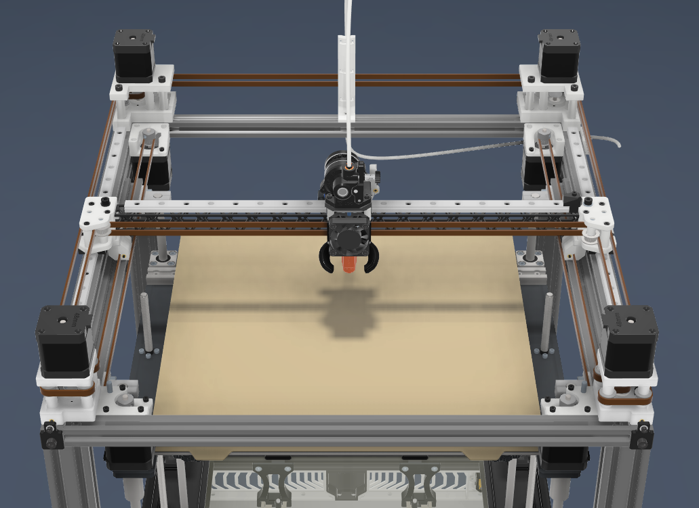
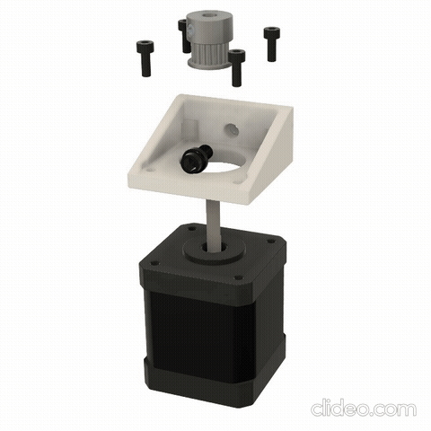
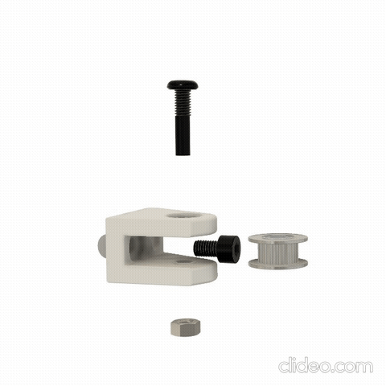
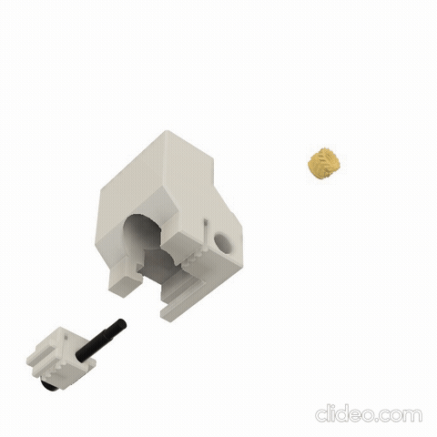

# 8WD 6mm Mercury1.1 mod


# BOM:
Some parts will not be mentioned because they come with the mercury kit.
| Type | Quantity | Link |
| --- | --- | --- |
| Shoulder skrews 40mm long 5mm! shaft with M3 thread ([check picture](IMAGES/Shoulder_skrews.png) ) | 16 | [Aliexpress](https://www.aliexpress.com/item/1005004802215831.html) |
| M5 1mm shims (6 you can extract from the tensioners) | 26 | [Nindejin](https://www.aliexpress.com/item/4000174460068.html) |
| F695-2RS bearings(4 are in the tensioners) | 16 | [Fushi](https://www.aliexpress.com/item/32850989216.html) |
| M5 x 30 dowel pins (the ones from the tensioners) | 2 |  |
| M5 x 20 dowel pins | 2 |  |
| M5x55 screws | 4 | [Nindejin](https://aliexpress.com/item/1005005267980793.html) |
| M5 X 8 | 6 |  |
| M5 x 20 Flat Head screws | 2 |  |
| M5 x 20 SHCS screws(2 from the tensioners) | 6 | [Nindejin](https://vi.aliexpress.com/item/4000142028043.html) |
| M5 x 10 screws | 6 | [Nindejin](https://vi.aliexpress.com/item/4000142028043.html) |
| M5 T-nut | 12 | [Aliexpress](https://vi.aliexpress.com/item/32706208829.html) |
| M5 Hexnut | 2 |  |
| M5 Heatset insert M5 X D7.0 X L9.0 | 2 | [Aliexpress](https://vi.aliexpress.com/item/4000232990523.html)  |
| M3 X 8 | 10 |  |
| M3 X 20 | 2 |  |
| M3 X 25 | 6 |  |
| M3 heat set inserts (2 from the tensioners) | 6 |  |
| Gt2 20T Idler 8.5mm tall | 4 | [Mellow](https://www.aliexpress.com/item/1005004374407134.html) |
| GT2 or GT3 6mm belts | 8 Meters | [TriangleLab](https://www.aliexpress.com/item/1005006507781085.html) |
| Gt2 20T Motor pulley | 8 | [Mellow](https://www.aliexpress.com/item/33023279793.html) |
| Motors like the one you use in the back to match | 6 | [Biqu](https://biqu.equipment/products/ldo-42sth48-2504ac-reva-motor-driver?variant=39991585636450) |
| Stepper drivers available to drive the extra motors | 6 |  |

### Optional for Double shear:
| Type | Quantity | Link |
| --- | --- | --- |
| Motors with 35mm minimum shaft lenght | 4 | [RatRig](https://ratrig.com/electronics/motors/nema-17-stepper-motor-ht-48mm-1-8-76oz-in-35mm-shaft.html)|
| 695-2RS bearings | 4 | [Fushi](https://vi.aliexpress.com/item/1005003141257945.html?pdp_npi=4%40dis%21RON%21RON%2048.29%21RON%2042.07%21%21%2110.33%219.00%21%40210390c217305813520083967e1b2f%2112000024314826797%21sh%21RO%21921752181%21X&spm=a2g0o.store_pc_allItems_or_groupList.new_all_items_2007521272189.1005003141257945&gatewayAdapt=glo2vnm) |

# Build Instructions

## AWD Belt paths
**:warning:! You must flip the xjoints bearing stacks and pulleys upside down !:warning:**

### Bottom belt path


### Top belt path


## How to sync motors

[VZbot Motor sync](https://www.youtube.com/watch?v=so9oqJyirKY)

## Hybrid Instructions

---

### Motor Assembly:



---

### Idler Assembly:



---

### Carriage Assembly:



---

You can also use the [STEP](STEP/Hybrid_CoreXY_Assembly_5Plus.f3d) file as a guide.


# Printer config

First ssh into the klipper host and install klipper-extended-corexy-kinematic
```
cd ~
git clone https://github.com/SnakeOilXY/klipper-extended-corexy-kinematic
cd klipper-extended-corexy-kinematic
./install.sh
```

-The X and Y motors are now swithed and rotating backwards because of the new belt path so the pins must be swithed 

-For config stepper_x now becomes stepper_a, stepper_y is now stepper_b and the steppers for the hybrid are stepper_c, stepper_c1, stepper_c2 and stepper_c3 (!the steppers c and c1 rotate in oposite directions so one of them must have the dir pin negated and the other stepper not negated!)

-The front motors will be defined as stepper_a1 and stepper_b1 the step and dir pins will need to have the same sign in front ( both a and a1 sould have DIR and STEP pin with ! or without, same for b and b1)

-Lower the homing speed to 10 and the motor amps to 0.4 or as low as you cand get them to move so that you have time to stop the printer if it goes the wrong direction and minimize the damage if the endstop pins are wrong. Press the endstops manualy while homing to see if the endstops are configured ok.

-When you configure Stepper c use the min max and position endstop from stepper y and for endstop pin use a pin that is not used on the board because the config requires it even if while homeing we use the b stepper to home y axis "home_y_axis_with_b_rail : True" 

-For more details check the github for the [klipper-extended-corexy-kinematic](https://github.com/SnakeOilXY/klipper-extended-corexy-kinematic)
or join the official ZeroG discord and ask in the community tab in Hybrid CoreXY Mod.

--My config as an example:
```
############################## Printer ##############################
[printer]
kinematics: extended_corexy
home_y_axis_with_b_rail : True
############################## Printer End ##############################

################################### A Axis Steppers ###################################

################# A Axis Stepper 1 #################
[stepper_a]
step_pin: PC14
dir_pin: !PC13
enable_pin: !PE6
microsteps: 16
rotation_distance: 40
endstop_pin: ^orbitoolO2:PB0
position_endstop: 375
position_max: 375
homing_speed: 150

[tmc5160 stepper_a]
cs_pin: PD6
spi_software_sclk_pin: PC6
spi_software_mosi_pin: PC8
spi_software_miso_pin: PC7
#diag1_pin: PC15
run_current: 1.400
sense_resistor: 0.022
interpolate: true

[autotune_tmc stepper_a]
motor: ldo-42sth48-2504ah
tuning_goal: performance
voltage: 48
################# A Axis Stepper 1 End #################

################# A Axis Stepper 2 #################
[stepper_a1]
step_pin: PE2
dir_pin: !PE1
enable_pin: !PE0
microsteps: 16
rotation_distance: 40

[tmc5160 stepper_a1] 
cs_pin: PD4
spi_software_sclk_pin: PC6
spi_software_mosi_pin: PC8
spi_software_miso_pin: PC7
#diag1_pin: PF1
run_current: 1.400
sense_resistor: 0.022
interpolate: true

[autotune_tmc stepper_a1]
motor: ldo-42sth48-2504ah
tuning_goal: performance
voltage: 48
################# A Axis Stepper 2 End #################

################################### A Axis Steppers End ###################################


################################### B Axis Steppers ###################################

################# B Axis Stepper 1 #################
[stepper_b]
step_pin: PE5
dir_pin: !PE4
enable_pin: !PE3
microsteps: 16
rotation_distance: 40
endstop_pin: PC0
position_endstop: 370
position_max: 370
position_min: 0
homing_speed: 150

[tmc5160 stepper_b]
cs_pin: PD5
spi_software_sclk_pin: PC6
spi_software_mosi_pin: PC8
spi_software_miso_pin: PC7
#diag1_pin: PF0
run_current: 1.400
sense_resistor: 0.022
interpolate: true

[autotune_tmc stepper_b]
motor: ldo-42sth48-2504ah
tuning_goal: performance
voltage: 48
################# B Axis Stepper 1 End #################


################# B Axis Stepper 2 #################
[stepper_b1]
step_pin: PB9
dir_pin: !PB8
enable_pin: !PB7
microsteps: 16
rotation_distance: 40

[tmc5160 stepper_b1] 
cs_pin: PD3
spi_software_sclk_pin: PC6
spi_software_mosi_pin: PC8
spi_software_miso_pin: PC7
#diag1_pin: PF2
run_current: 1.400
sense_resistor: 0.022
interpolate: true

[autotune_tmc stepper_b1]
motor: ldo-42sth48-2504ah
tuning_goal: performance
voltage: 48
################# B Axis Stepper 2 End #################

################################### B Axis Steppers End ###################################


################################### C Axis Steppers ###################################

################# C Axis Stepper 1 #################
[stepper_c]
step_pin: PB4
dir_pin: !PB3
enable_pin: !PB5
microsteps: 16
rotation_distance: 40
endstop_pin: PF4
position_endstop: 370
position_max: 370
position_min: 0
homing_speed: 150

[tmc5160 stepper_c]
cs_pin: PA9
spi_software_sclk_pin: PC6
spi_software_mosi_pin: PC8
spi_software_miso_pin: PC7
run_current: 1.400
sense_resistor: 0.075
interpolate: true

[autotune_tmc stepper_c]
motor: ldo-42sth48-2504ac
tuning_goal: performance
voltage: 48
################# C Axis Stepper 1 End #################

################# C Axis Stepper 2 #################
[stepper_c1]
step_pin: PG15
dir_pin: PB6
enable_pin: !PG14
microsteps: 16
rotation_distance: 40

[tmc5160 stepper_c1]
cs_pin: PA10
spi_software_sclk_pin: PC6
spi_software_mosi_pin: PC8
spi_software_miso_pin: PC7
run_current: 1.400
sense_resistor: 0.075
interpolate: true

[autotune_tmc stepper_c1]
motor: ldo-42sth48-2504ac
tuning_goal: performance
voltage: 48
################# C Axis Stepper 2 End #################

################# C Axis Stepper 3 #################
[stepper_c2]
step_pin: PG9
dir_pin: !PG10
enable_pin: !PG13
microsteps: 16
rotation_distance: 40

[tmc5160 stepper_c2]
cs_pin: PD2
spi_software_sclk_pin: PC6
spi_software_mosi_pin: PC8
spi_software_miso_pin: PC7
run_current: 1.400
sense_resistor: 0.075
interpolate: true

[autotune_tmc stepper_c2]
motor: ldo-42sth48-2504ac
tuning_goal: performance
voltage: 48
################# C Axis Stepper 3 End #################

################# C Axis Stepper 4 #################
[stepper_c3]
step_pin: PG11
dir_pin: PD7
enable_pin: !PG12
microsteps: 16
rotation_distance: 40

[tmc5160 stepper_c3]
cs_pin: PA15
spi_software_sclk_pin: PC6
spi_software_mosi_pin: PC8
spi_software_miso_pin: PC7
run_current: 1.400
sense_resistor: 0.075
interpolate: true

[autotune_tmc stepper_c3]
motor: ldo-42sth48-2504ac
tuning_goal: performance
voltage: 48
################# C Axis Stepper 4 End #################

################################### C Axis Steppers End ###################################

```

# Testing

When first homing do not tighten the grub skrews on the steppers c and c1 so that if the direction is set wrong in the config nothing breaks.

Also I recommend to set both grub skrews of the pulley on the round side of the motor shaft so that the motors do not force the gantry to twist.

Validate each motor is turning in the corect direction and home the printer and then while the motors are still powered tighten the pulleys.


Respect the mentions in the printer config tab as well.
