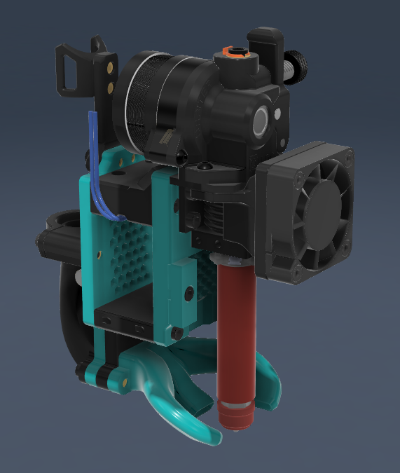

# STD6 Toolhead based on eva2.4 for Mercury1.1 -- !! In testing !!

# BOM:
| Type | Quantity | Link |
| --- | --- | --- |
| M3 X 35 | 5 | [Nindejin](https://vi.aliexpress.com/item/4000142028043.html) |
| M3 x 25 | 2 | [Nindejin](https://vi.aliexpress.com/item/4000142028043.html) |
| M3 x 18 | 4 | [Nindejin](https://vi.aliexpress.com/item/4000142028043.html) |
| M3 x 10 | 16 | [Nindejin](https://vi.aliexpress.com/item/4000142028043.html) |
| M3 Hexnuts | 2 | [Nindejin](https://vi.aliexpress.com/item/4000152457370.html) |
| Heatset inserts | 24 | [Aliexpress](https://vi.aliexpress.com/item/4000232858343.html) |
| STD6 Hotend | 1 | [TriangleLab](https://trianglelab.net/products/std6-ceramic-heating-core?VariantsId=11845) |
| Orbiter Extruder (v2.0 or v2.5) | 1 | [TriangleLab](https://trianglelab.net/products/orbiter-extruder-v20?VariantsId=10239) |
| Cpap fan pipe an turbo | 1 | [Biqu](https://biqu.equipment/products/universal-turbo-kit) |

### Optional for Extended version:
| Type | Quantity | Link |
| --- | --- | --- |
| MZE (Melt-zone-extender) | 1 | [TriangleLab](https://www.trianglelab.net/products/zs%C2%AE-mze%E2%84%A2-melt-zone-extender)
| Copper Plated nozzle | 1 | [TriangleLab](https://trianglelab.net/products/t-v6-plated-copper-nozzle?VariantsId=10024) |
