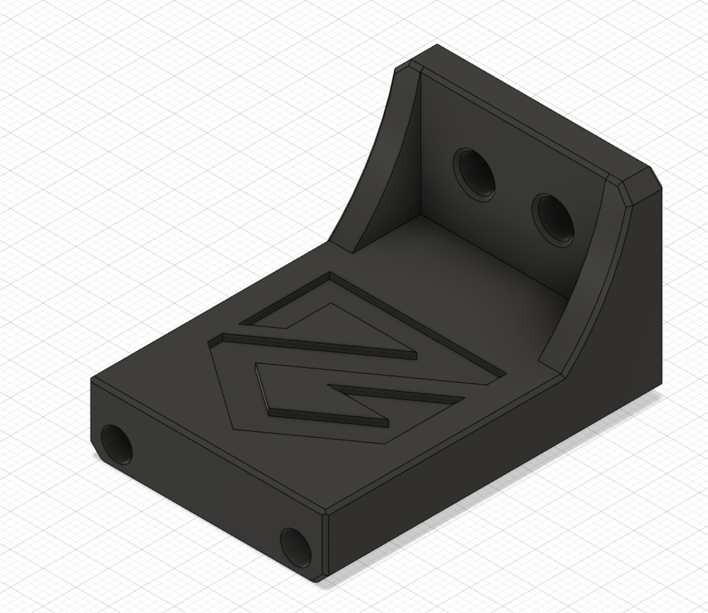
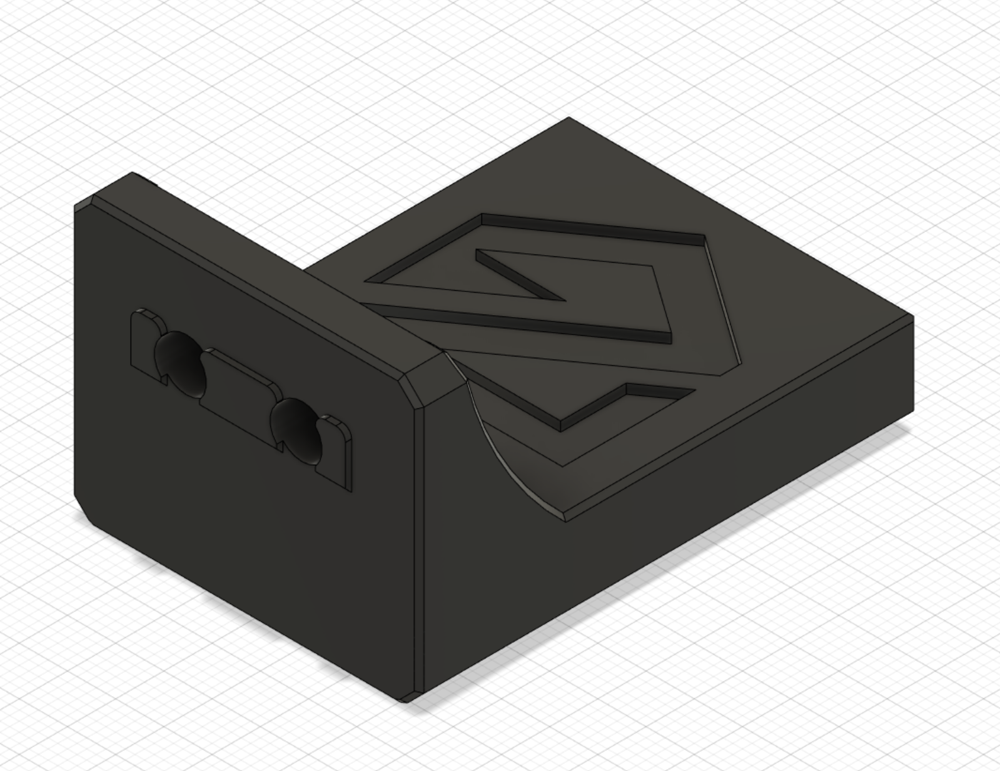

Intro:

This is dsigned for the Ender 5 Plus on the Mercury One System using a Stealthburner

Materials:

  M5x10 BHCS Q=2

  M5 T-Nut Q=2

  M3x4x5 Heatset Insert Q=2

Credit:
  
This is meant to be used with Klicky by jlas1 https://github.com/jlas1/Klicky-Probe.git

Images - 

