# How to contribute

In order to contribute your mod or slicer profile you need to follow these steps:

1. Make sure you are logged into github (or create an account)
2. Go to [UserMods Repo](https://github.com/ZeroGDesign/UserMods)
3. Fork the repository
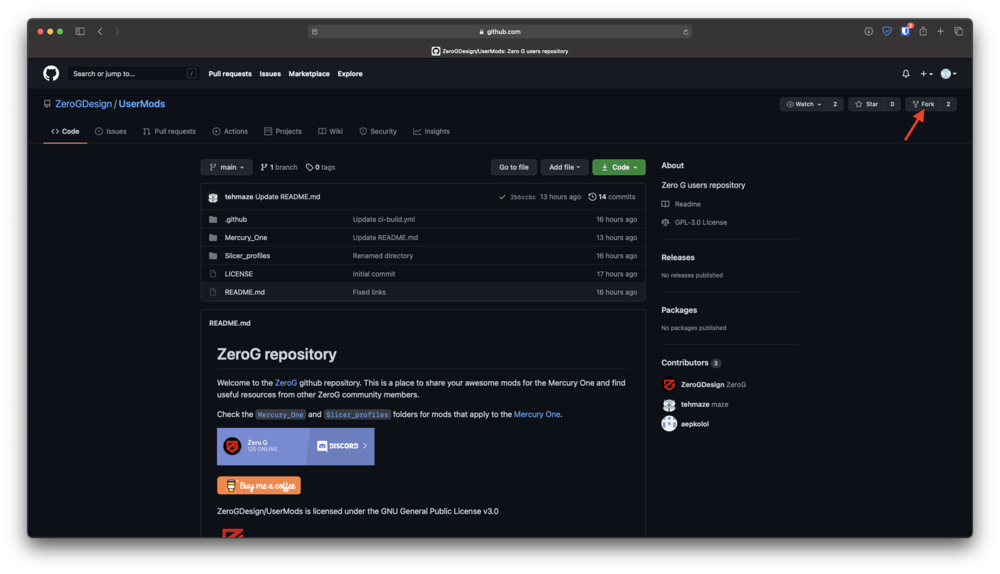
4. Upload your files to the right directory (make sure you are in the right repository)
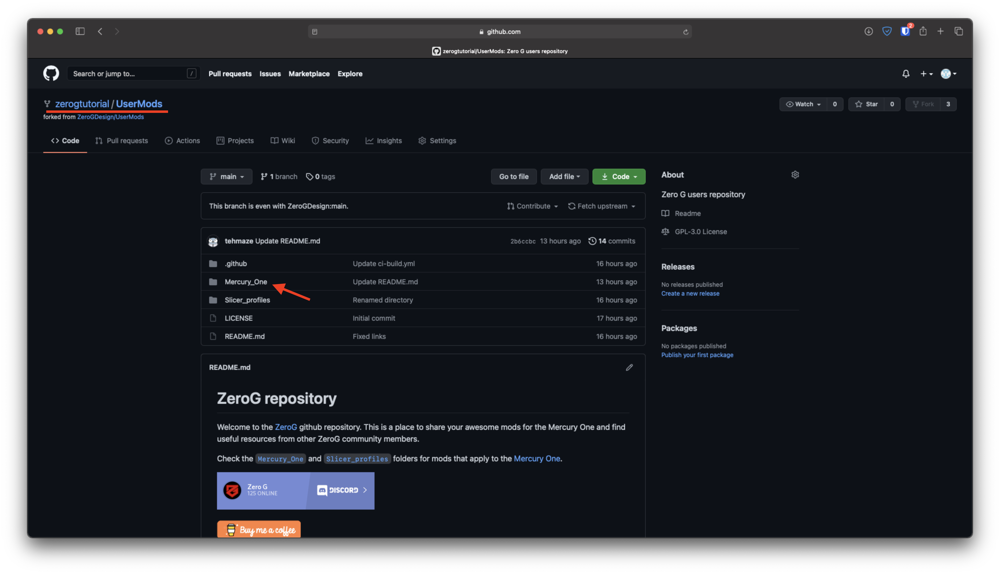
5. Add your files
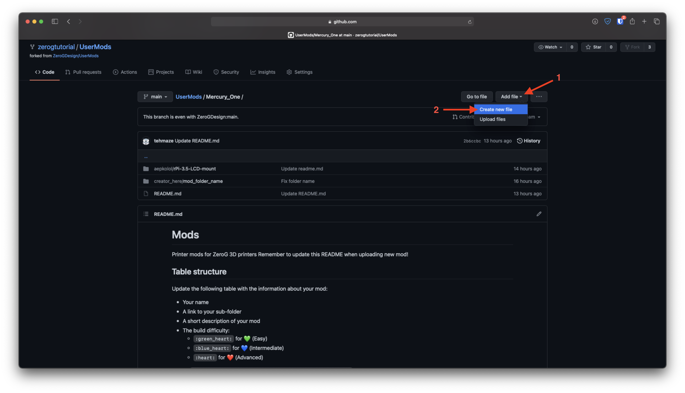
	1. Click on `Add files`
	2. Click `Create new file`
6. Create a directory structure containing your nickname followed by `/` and mod name
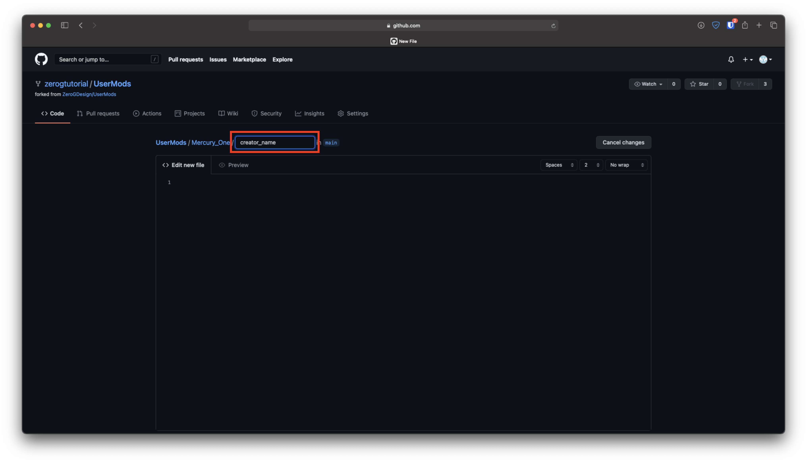
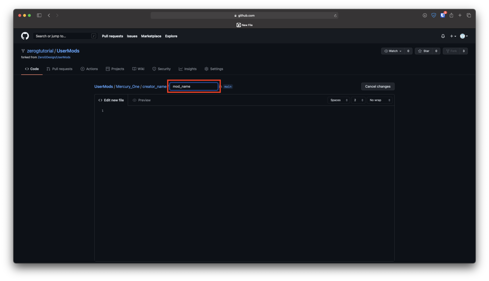
7. Drag and drop the file you want to upload (2), remember also to name it (1)
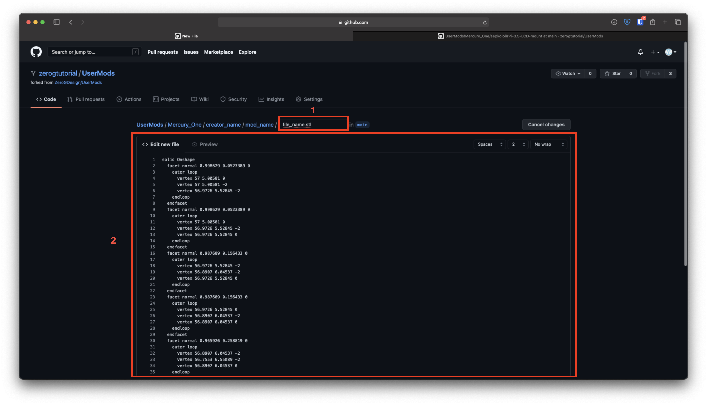
8. Commit the file
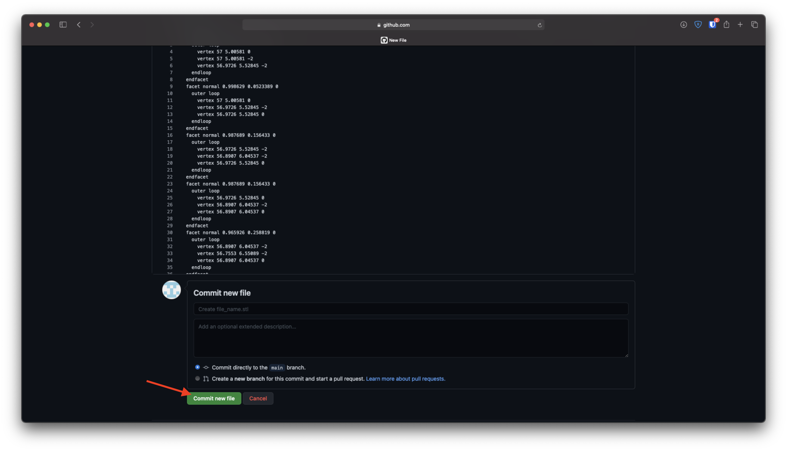
9. Edit `README.md` by adding your mod to the table (remember to commit the edited file!)
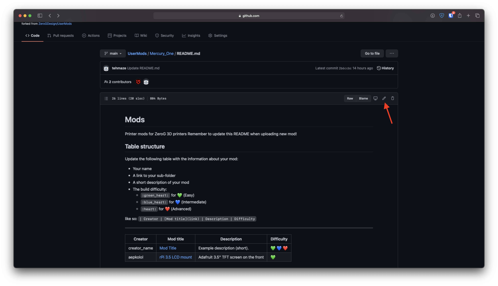
10. Go to Pull reqests section
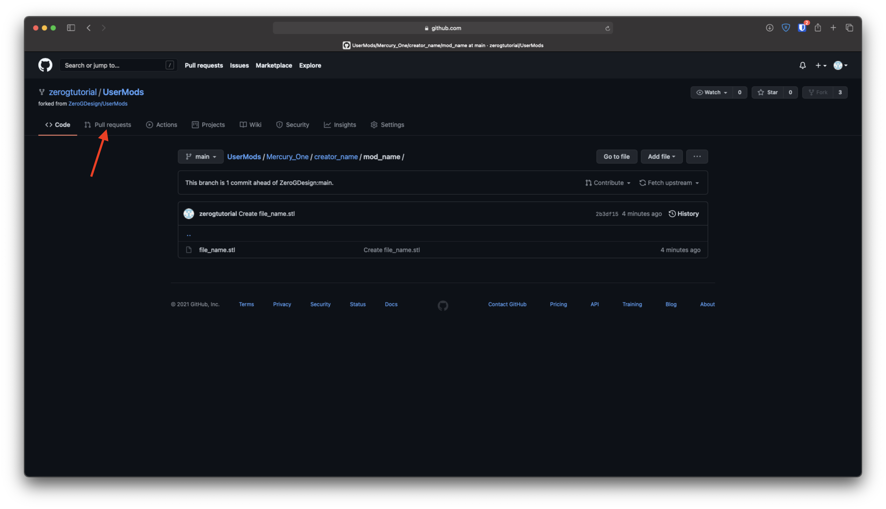
11. Click on `New pull request` button
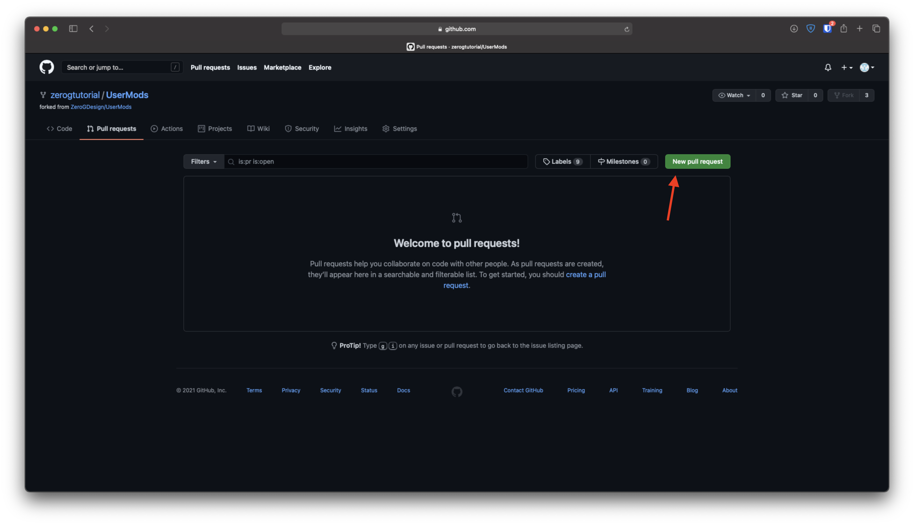
12. Make sure you are targetting a correct branch (1) and click on `Create pull request` (2)
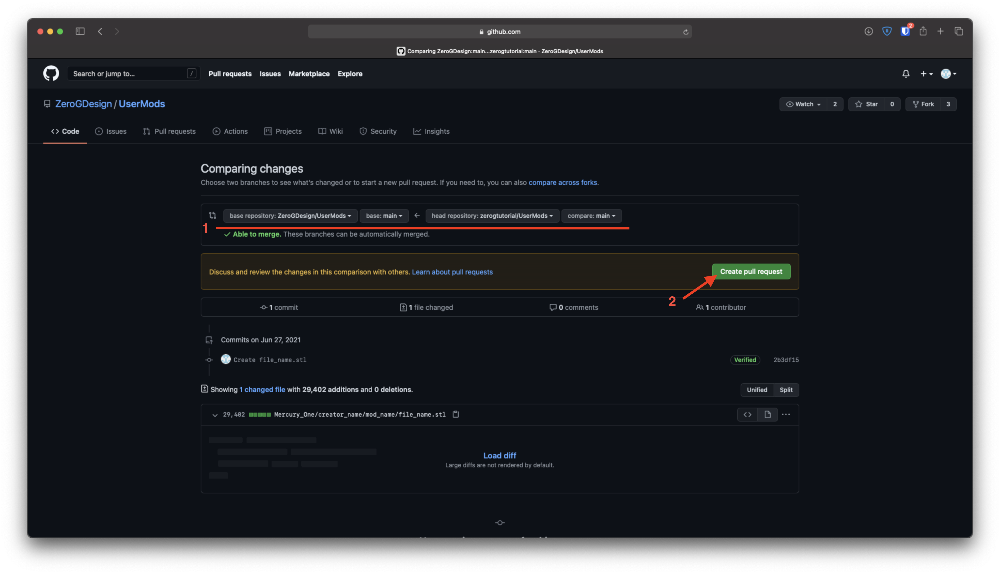
13. Wait for your request being approved and merged into UserMods repo